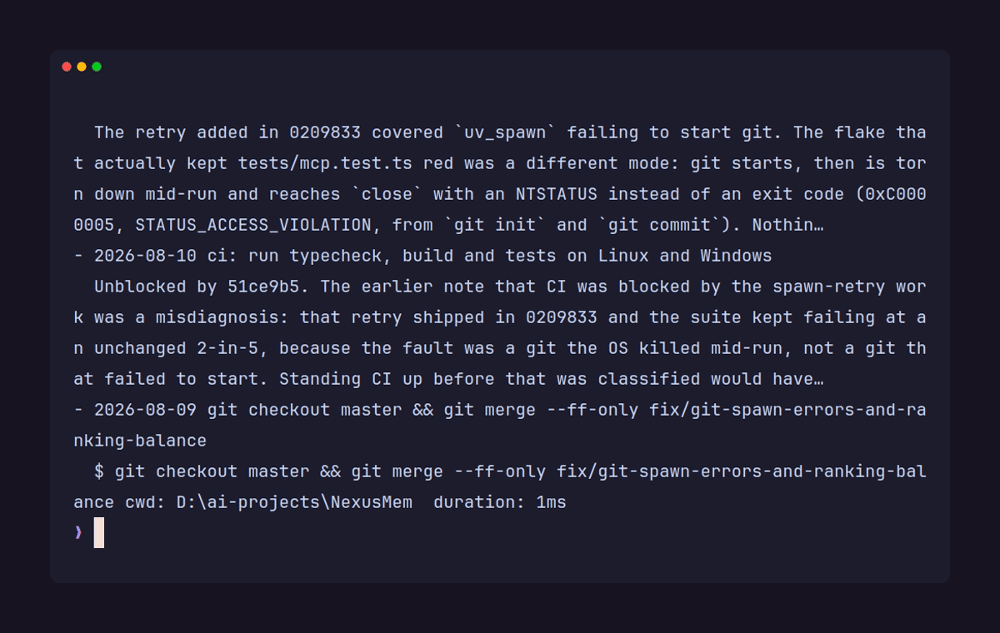

# NexusMem

[](https://github.com/yaminbakoh4-dot/NexusMem/actions/workflows/ci.yml)
[](https://www.npmjs.com/package/nexusmem)
[](https://www.npmjs.com/package/nexusmem)
[](LICENSE)




Your coding agent can read `git log`. It cannot read the four things you tried last Tuesday that
didn't work.

NexusMem records what actually happened on your machine (shell commands and their exit codes, git
history down to the patch of each changed file, project docs, optionally your assistant transcripts)
into a local SQLite database, and
serves back a ranked, token-budgeted slice of it on demand. Everything stays on disk. No account, no
cloud, no telemetry.

The shell history is the part worth caring about. Git tells an agent what shipped. Shell history
tells it what was attempted, in what order, and which commands exited non-zero. That information
exists nowhere else, and it disappears when your terminal scrollback rolls over.

## Try it

From inside any git repository:

```
npx nexusmem init
npx nexusmem sync
```

Then ask it something. Real output from this repository, top 2 of 5 hits:

```
$ nexusmem query "windows spawn failure"

Relevant history for: windows spawn failure

- 2026-08-09 fix: distinguish a failed git spawn from "not a git repository"
  readRepoInfo collapsed three unrelated failures into one error: git running and reporting
  the path is not a work tree, git not being installed, and the process failing to spawn at
  all. Dogfooding hit the third case in two separate sessions...
- 2026-08-09 README.md — Before a tagged release
  - [ ] Retry on transient process-spawn failures on Windows
```

A commit and a docs section, ranked against each other, inside whatever token budget you gave it.
Nothing was summarized by a model on the way out; the ranker just decided what not to send. (One
optional source, session summaries, does run a local model — but at ingest time, never on the way
out. What you query is always stored text.)

For a sense of what actually accumulates, here is `nexusmem status` on this repo after two days:

```
527 node(s)  2026-08-08 .. 2026-08-09
       321  shell_command
       130  conversation_turn
        60  doc_section
        16  git_commit
```

Sixteen commits. Three hundred and twenty-one shell commands. The commits were already retrievable
by any agent with a terminal. The rest was not.

That `conversation_turn` row only appears because this corpus was synced with `--conversation`.
Assistant transcripts are the one source that is off by default and stays off until you opt in, since
they are the likeliest place for a pasted credential to be sitting. A default install indexes git
commits, their diffs, shell and docs.

Requirements: Node 22 or newer, and git. Node 20 will not work, because `better-sqlite3` ships no
prebuilt binary for it and Node 20 went end-of-life in April 2026. Ollama is optional and only
affects semantic search (see below).

## How retrieval works

Every source normalizes to the same `MemoryNode` shape, so a commit, a shell command and a docs
section compete on equal terms. Retrieval runs BM25 over FTS5 and, if an embedding model is
reachable, a vector search over `sqlite-vec`, then fuses the two with Reciprocal Rank Fusion.

RRF fuses on rank *position* only, never on raw scores. That is the entire reason it is safe here: a
BM25 cost and a vector distance live on unrelated, unbounded scales, and position is the only thing
they agree on. No hand-tuned normalization constant sits between them.

Ranking then multiplies three factors:

```
score = relevance × signal^0.215 × recency^0.288
```

`relevance` comes from the query. `signal` (a `fix:` commit outranks a `chore:`; a command that
exited non-zero outranks one that succeeded) and `recency` are priors that hold before any query
exists. Each factor is floored into `[floor, 1]` rather than `[0, 1]`, so one weak dimension cannot
zero out a strong match.

Those exponents are derived, not tuned. Priors kept overturning the query: on one real query a `fix:`
commit took rank 1 from a better-matching docs section on a 44% signal edge against a 15% relevance
deficit. So the priors get a **shared** budget — across their whole range they may overturn at most a
2× relevance gap — split evenly between them, and each is raised to the power that makes its own span
worth exactly its share (`span^exponent = √2`). Priors still order equally-relevant hits exactly as
before, since the transform is monotonic. They just cannot outvote the question anymore.

The budget is shared rather than per-prior for a reason found by dogfooding, not by reading the
arithmetic: the score *multiplies* the priors, so capping each at 2× separately left the pair free to
overturn 4×. That describes every commit made during an active working day — fresh and high-signal at
once — so the failure landed on precisely the days with the most worth remembering. A query about the
PowerShell hook returned two unrelated same-day `fix:` commits at ranks 3 and 4 while the section that
answered it sat at rank 6. Adding a third prior now re-divides the same budget instead of enlarging it.

Without Ollama, vector search is skipped and you get BM25 only. That path is fully supported, not a
degraded error state; `sync` and `query` both succeed and simply do less.

## Session summaries (optional, local model)

With `sources.session.enabled`, each finished session becomes one distilled node next to the raw
exchanges — what was decided and why, rather than forty individual turns. It runs a local Ollama
chat model (`qwen2.5:3b` by default); nothing is downloaded automatically and nothing leaves the
machine.

```bash
nexusmem scan-session --dry-run
```

That prints the exact prompt a session would produce, after redaction and budget trimming, without
calling the model.

Three things bound the cost. A session is only summarized once it has been quiet for
`settleMinutes` (default 30), so a session in progress is not re-summarized on every sync. The
prompt is hashed, and an unchanged hash skips the model entirely — on this repo a steady-state sync
of 14 summarized sessions takes 0.25s and makes no model calls. And `maxSessions` (default 10) caps
how many reach the model per run; the rest are reported as queued and picked up next sync.

**What it is actually like, measured on 14 real sessions with `qwen2.5:3b`.** The summaries
themselves are good: decisions with their reasons, in the shape the prompt asks for. Titles are less
reliable — the model returned a usable one about a third of the time, and otherwise produced a
conversational preamble, a stray bullet, or a bare "Summary of the Session". Those are rejected and
the title falls back to the first line of the question that opened the session, which is always
specific even when it is not elegant. Compliance was worst on long sessions and on transcripts not
in English. A larger model (`qwen2.5:7b`) is the lever if the titles matter to you; set
`sources.session.model`.

## Use it from an agent

```json
{
  "mcpServers": {
    "nexusmem": {
      "command": "npx",
      "args": ["-y", "nexusmem", "mcp"]
    }
  }
}
```

Three tools over stdio: `search_memory` returns the packed context block, `sync_project` ingests, and
`get_status` reports what is currently remembered. Each takes an explicit `projectRoot`, because an
MCP tool call carries no shell working directory. `sync_project` runs `init` for you if the
repository has not been set up.

## Optional: exact shell capture

Scraped history files (PSReadLine, `.bash_history`, `.zsh_history`) give you command text and not
much else. The hook gives you working directory, exit code and a real timestamp:

```bash
nexusmem hook install
```

It wraps your existing PowerShell prompt rather than replacing it, is idempotent, and
`nexusmem hook remove` undoes it cleanly.

Exit codes are what make this worth installing. A failed command is a stronger signal than a
successful one, and without the hook there is no way to tell them apart.

## What it costs you

Two numbers get conflated in tools like this, so they are kept apart here.

**Packer efficiency** is how much the ranker trims from its own candidate set. On this repository's
corpus it runs 81–84%. It is useful for tuning the ranker and useless as a claim about your bill,
because the baseline is hypothetical: without NexusMem those candidates were never going into your
context window in the first place.

**End-to-end saving** compares packed context against reading the equivalent files in full. Measured
at **~40%** on design queries against this codebase, hand-tallied from one real session rather than
instrumented. Treat it as an order of magnitude.

The long-term target is >70%, and this repository cannot demonstrate it. That figure describes repos
with thousands of commits, where the win comes from omitting hundreds of unrelated items rather than
shaving a handful. A benchmark at that size is still outstanding, and until it exists the honest
number is 40%.

One thing that is not a percentage: shell commands and conversation turns have no cheap `grep`
equivalent. Without something recording them, they are gone, not merely more expensive to find.

Latency on a ~530-node corpus, warm, p50 over 10 runs:

| Operation | |
| --- | --- |
| BM25 retrieval (FTS5) | ~1.1 ms |
| Vector KNN (`sqlite-vec`) | ~3.2 ms |
| Fuse, rank, pack | ~0.6 ms |
| Query embedding (local Ollama) | ~55–77 ms |
| **End-to-end hybrid** | **~56 ms** |

All the SQLite work totals about 5 ms. The embedding call is the only thing on this path worth
optimizing, and it is somebody else's process.

## Where it breaks

- **Shell history without the hook is unscoped.** Scraped history has no directory context, so it is
  attributed to whichever repository you ran `sync` from. Bounded to a tail window, and an
  approximation rather than a guarantee.
- **Japanese and Chinese depend on the vector pass.** FTS5's `unicode61` tokenizer splits on
  whitespace, so languages without space boundaries get no useful BM25 recall.
- **Rebasing strands nodes.** Rewritten history leaves nodes for unreachable commits. They describe
  real events so they are not wrong, but a targeted prune does not exist yet. `sync --rebuild`
  forces a clean re-scan.
- **Multi-line PowerShell input is read as separate commands.** A function typed across several lines
  at the prompt is not reconstructed.
- **Scrape-fallback ids drift** if the history file is trimmed from the front between syncs.
  Installing the hook fixes this.
- **Session-summary titles depend on the model following instructions**, and a 3B model often does
  not. The fallback keeps them specific rather than generic, but see the section above for what to
  expect.
- **Changing the embedding model re-embeds everything.** Vectors from two models are not comparable
  and `nodes_vec` records no per-row provenance, so `sync` drops the lot and rebuilds rather than
  ranking across a mixture. It says so when it happens. Nodes are untouched and BM25 keeps working
  throughout.
- **Diff indexing is bounded, and deliberately lossy.** A first sync indexes the patches of the most
  recent 200 commits (later syncs only walk `cursor..HEAD`); merge commits contribute none, since
  their patch exists only in a combined format this parser does not read; and binaries, lockfiles and
  build output are skipped so a dependency bump cannot bury the corpus. All of it is still recorded
  as a `git_commit` node. A patch longer than `limits.maxBodyChars` is truncated, so the tail of a
  very large change is not indexed. The caps live under `sources.diff` in `config.json`.
- **Cross-project recall favours breadth.** Each repository's hits are fused by rank, so a project
  whose best match is mediocre still contributes a rank-1 item, and rank 1 is worth the same in
  every list. Adding a repository that has little to say about your question still pushes a few of
  its results into the budget. Signal, recency and the budget are what hold that in check; there is
  no per-project quality weight.
- **The project registry is an index, not a source of truth.** It can point at a database that has
  moved or been deleted; those are reported and skipped, never silently pruned, because an
  unmounted drive is not a deleted project.
- **Conversation chunking is unevaluated.** Splitting long replies at heading boundaries measurably
  helped, but it has never been tested systematically.
- **A chunked node's sibling count in one result is capped, not tuned.** `conversation_turn` and
  `doc_section` both split one reply or file into several nodes; at most 2 of them may appear
  together in a packed result. Found live: a query for "token" returned 9 of its top 12 hits as
  different pieces of one heavily-sectioned reply, crowding out the node that actually answered it.
  The cap of 2 is a judgement call, not a measured optimum, same as the ranking priors' budget above.
- **The size of the prior budget is a judgement call, not a measured optimum.** Priors are now
  bounded jointly rather than one at a time, which closed a real 4× hole (see the ranking section),
  but the 2× budget itself has never been tuned against a labelled relevance set — there isn't one.
  It is a defensible constant, not a result. What is measured is the direction: on four real queries
  against this repo's own memory, switching to the joint cap moved the section that answered the
  question up in three of them (the rationale section for "why BM25 before vector search" went from
  rank 4 to rank 1) and displaced no query's correct top hit.

## Commands

`init`, `sync`, `query <text>`, `status`, `projects`, `mcp`, and `hook install|remove|status`.

There are also five dry-run previews (`scan-git`, `scan-diff`, `scan-shell`, `scan-docs`,
`scan-conversation`)
that write nothing and print the nodes ingestion *would* create along with their signal scores. That
is the intended way to tune scoring against a real repository before committing to a change. Add
`--json` to pipe them somewhere.

Every command takes `-C <path>` to target another repository. On `sync`, `--conversation` opts the
transcript source in for one run without persisting it, `--no-embed` skips the vector pass, and
`--rebuild` drops the project's nodes and re-ingests from scratch.

## Recall across projects

`query --all-projects` searches every repository you have run NexusMem in, not just the current one,
and tags each result with the repository it came from:

```
$ nexusmem query --all-projects "why was the retry budget raised"
scope   2 project(s): NexusMem, uploader

- 2026-08-12 [uploader] fix: raise the retry budget after the S3 upload timeouts
- 2026-08-12 [uploader] retry.ts @ 8d0f98b — fix: raise the retry budget after the S3 upload timeouts
  @@ -1 +1 @@
  -export const RETRY_BUDGET = 3;
  +export const RETRY_BUDGET = 5;
- 2026-08-09 [NexusMem] fix(git): retry a transient failure to spawn git
```

Databases stay per-repository — there is no shared global store, and deleting one repo's
`.nexusmem/` still removes exactly that repo's memory. What makes the others findable is a plain
index at `~/.nexusmem/projects.json`, written by `init` and refreshed by every `sync`. `nexusmem
projects` shows what is in it, and `--prune` forgets entries whose database is gone.

Ranking across repositories uses reciprocal rank fusion per project rather than raw BM25, because a
BM25 cost is computed against its own corpus and means different things in a 50-node and a
50,000-node database. The trade is stated in *Where it breaks*.

The MCP `search_memory` tool takes the same switch as `allProjects: true`.

## On disk

```
<repo>/.nexusmem/
  .gitignore     '*' — the workspace ignores itself, so init never edits a file it doesn't own
  config.json    validated on read; a corrupt config fails loudly rather than silently
  memory.db      SQLite in WAL mode

~/.nexusmem/
  projects.json      which repositories exist, for cross-project recall; a corrupt one reads as empty
  shell-history.jsonl  the hook's log, if you installed it
```

`NEXUSMEM_HOME` overrides the user-scoped directory.

Node ids are content-addressed from `sha256(projectId + kind + naturalKey)`, so running `sync` twice
cannot produce duplicates and ingestion stays correct even if a cursor is lost. Project identity
comes from the normalized origin URL when there is one, falling back to the absolute path, so two
clones of the same repo share one memory namespace.

Deleting `.nexusmem/` loses nothing that `sync` cannot rebuild.

## Status

Ingestion, hybrid retrieval, budgeted packing and the MCP server all work and are covered by 315
tests running on Linux and Windows across Node 22 and 24. Phase 3 is complete.

## Development

```bash
npm install
npm run typecheck
npm test
npm run build
```

Tests are behavioral rather than snapshot-based, and several are regressions tied to specific
observed failures. `tests/git-errors.test.ts` injects a fake `spawn` to exercise the Windows
process-spawn faults, which cannot be provoked on demand.

## On how this was built

This started as an experiment in whether a local context-memory engine for coding agents was viable,
prototyped with Claude Code. The code was written through AI-assisted workflows; the architecture,
the design decisions and the specifications were human-directed.

That is worth stating plainly because it should change how you read the code, not whether you trust
it. Audits, corrections and PRs are genuinely welcome, and the commit history is deliberately
detailed about *why* things are the way they are, including the times an earlier assumption turned
out to be wrong.

## License

MIT
